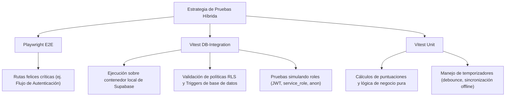

# Architecture Decision Document

_This document builds collaboratively through step-by-step discovery. Sections are appended as we work through each architectural decision together._

## Project Context Analysis

### Requirements Overview

**Functional Requirements:**
- **Autenticación Express (FR-1):** Registro e inicio de sesión de un solo toque con Google OAuth.
- **Invitación Inteligente (FR-3, FR-4, FR-23, FR-24):** Flujo de invitación mediante enlaces profundos que unen al jugador automáticamente a la liga privada tras autenticarse, mostrando instrucciones de cobro si el administrador activa el pago requerido.
- **Gestión Logística (FR-5, FR-6):** Marcado manual de pagos (público en la clasificación para presión social) y expulsión de miembros por parte del administrador.
- **Predicciones Táctiles y Auto-guardado (FR-7, FR-8, FR-9, FR-22):** Interfaz móvil optimizada con botones `+`/`-` de 48x48px que no despliegan teclado nativo. Auto-guardado con debounce de 500ms. Cierre automático de edición exactamente al inicio (kickoff) del partido.
- **Multiplicador por Antelación (FR-10, FR-11):** Mecánica de puntuación que incrementa la puntuación base (5 pts por marcador exacto, 2 pts por resultado de ganador/empate) de forma progresiva según la antelación del registro (hasta 2.0x si es >5 semanas antes del partido).
- **Módulo de Duelos (FR-12, FR-13, FR-14, FR-23):** Apuestas de puntos acumulados en duelos 1v1 directos u abiertos. Retención atómica de puntos en garantía ("escrow") y resolución automatizada del pozo. Compartir con WhatsApp Banter y landing pages dedicadas.
- **Premios Especiales (FR-15, FR-16):** Predicciones de Campeón, Goleador y MVP del Mundial con puntuación decreciente a medida que avanza el torneo (50/25/10/0 pts) cerrando antes de semifinales.
- **Clasificaciones Proyectadas en Tiempo Real (FR-17, FR-18, FR-19, FR-20, FR-21):** Visualización en vivo que actualiza los puestos reordenándolos según los marcadores del momento. Clasificaciones separadas por jornada, insignias humorísticas (Nostradamus, Tibio, Salado), criterios estructurados de desempate y tarjetas psicológicas de juego para compartir.
- **Sincronización de Datos en Tiempo Real (Mundial 2026):** Integración pasiva con la API deportiva de Zafronix mediante webhooks y fallback condicional con ETags para marcadores en vivo sin exceder la cuota de llamadas del plan gratuito.

**Non-Functional Requirements:**
- **Coste Cero ($0.00 USD):** Diseño completo basado en capas gratuitas (Vercel Hobby y Supabase Free Tier).
- **Rendimiento e Infraestructura:** Escalabilidad limitada a 200 conexiones WebSocket concurrentes. Recalculación de posiciones del lado del cliente en JavaScript para minimizar joins SQL complejos en el servidor por cada gol en vivo. Polling alternativo de respaldo si se cae el socket.
- **Seguridad (RLS, HMAC & Atomicidad):** PostgreSQL RLS activo para ocultar predicciones de rivales hasta 1 minuto antes del partido. Validación de firmas HMAC-SHA256 en webhooks de Zafronix usando secretos. Transacciones de apuestas en base de datos con verificación estricta de saldo para evitar gastos duplicados o balances negativos.

**Scale & Complexity:**
- La plataforma gestiona dinámicas de grupo altamente concurrentes y reactivas durante el mes del Mundial 2026.
- Requiere transaccionalidad robusta (ACID) para el sistema de puntos y escrow.
- La escala del proyecto requiere optimizaciones específicas en tiempo real para no exceder las cuotas gratuitas de base de datos.

- Primary domain: Web Full-Stack (Next.js 15, Supabase, Vercel)
- Complexity level: Medium-High
- Estimated architectural components: ~6 (Auth, Matches/Predictions, Leagues/Standings, Duelos/Escrow, Webhooks/Sync, Real-time Leaderboard)

### Technical Constraints & Dependencies
- **Vercel Hobby Plan Limits:** Límite de ancho de banda y tiempo de ejecución de Serverless Functions.
- **Supabase Free Tier Specs:** Límite de 500MB de base de datos y 200 conexiones WebSockets simultáneas.
- **Zafronix API Quota:** El plan gratuito de Zafronix permite 250 requests diarias. La sincronización principal se realiza pasivamente vía webhooks (sin coste de llamadas). El cron job de respaldo condicional envía la cabecera `If-None-Match` con el último `ETag` almacenado. Las respuestas `304 Not Modified` no decrementan la cuota diaria de la API.
- **Inactividad de Base de Datos:** Supabase pausa proyectos gratuitos tras 1 semana sin uso; se mitiga programando un keep-alive automático (ping diario).
- **Seguridad de Lectura:** Impedir lectura de predicciones activas hasta el momento del kickoff (`match_time`) para preservar la competitividad.
- **Validación de Kickoff en Servidor:** El bloqueo de edición exactamente al inicio se validará estrictamente en Supabase (mediante políticas RLS y triggers de escritura) usando la hora UTC del servidor de base de datos, ignorando la hora local del cliente.
- **Devoluciones de Escrow Automatizadas:** La baja de un miembro de la liga (FR-6) debe gatillar un proceso de base de datos que anule sus duelos 1v1 activos y regrese los puntos retenidos en garantía a los rivales sobrevivientes.
- **Control de Escrow por Creación (No por Aceptación):** Para evitar sobre-compromiso de saldo en desafíos pendientes, los puntos de la apuesta se deducirán del saldo disponible del creador y se moverán a escrow *en el momento de la creación* del reto.
- **Gestión de Robustez de Auth:** La base de datos y la UI implementarán fallbacks automáticos para nombres y avatares nulos procedentes de Google OAuth para asegurar la integridad de las tablas de perfiles.

### Cross-Cutting Concerns Identified
- **Gestión de Estado Reactivo:** Sincronización en tiempo real entre marcadores en juego, cálculos locales de puntuación y el reordenamiento de la clasificación en pantalla.
- **Manejo de Conexiones sin Red (Offline State):** Captura de predicciones de usuario sin conexión, marcado visual temporal en rojo (`{colors.destructive}`) y reintentos automatizados al volver a tener red.
- **Integridad Transaccional de Puntos (Double-Spending):** Garantizar que los puntos apostados en múltiples duelos 1v1 concurrentes no superen el balance disponible total del jugador mediante bloqueos atómicos en PostgreSQL.
- **Separación de Clasificación (Visual vs. Oficial):** El sistema separará la visualización reactiva temporal (JS en cliente para WebSocket en vivo de partidos activos) de la clasificación oficial de la liga (calculada e insertada de forma transaccional en el servidor al finalizar el partido).
- **Preservación Guiada del Multiplicador:** El tablero de predicciones en el cliente debe implementar una confirmación interactiva para evitar que clics accidentales en partidos guardados con antelación degraden el multiplicador del usuario.
- **Resiliencia ante Suspensiones de API:** El motor de puntuaciones y duelos dependerá estrictamente del estado oficial `finished` de los partidos. Si la API de Zafronix reporta un partido como `suspended` o `canceled` mediante `match.postponed`, el sistema de puntuaciones evitará repartir puntos y congelará o reembolsará los duelos según las reglas configuradas.
- **Control del Tiempo Basado en Servidor:** El servidor de base de datos aplicará de forma estricta e irreversible el bloqueo de transacciones usando la función `now()` de Postgres para evitar fraudes por manipulación del reloj del dispositivo cliente o latencias de red.
- **Verificación de Seguridad de Webhooks:** El webhook receptor `/api/webhooks/zafronix` debe validar obligatoriamente la firma `HMAC-SHA256` utilizando la firma provista en `X-Zafronix-Signature-256`, concatenada con la marca de tiempo `X-Zafronix-Timestamp` para evitar ataques de replay (rechazar solicitudes > 5 minutos de diferencia).


## Starter Template Evaluation

### Primary Technology Domain

Full-stack Web Application (Next.js 16.x + Supabase 2.x) basado en el análisis de requisitos del proyecto.

### Starter Options Considered

- **Opción 1: Next.js Supabase Starter (Seleccionada):** Boilerplate oficial optimizado para integración SSR con cookies. Configura automáticamente Tailwind CSS, TypeScript y las bases de clientes cliente/servidor para Next.js.
- **Opción 2: Next.js Manual Standard:** Inicialización básica que requiere configurar manualmente `@supabase/ssr`, clientes con manejo de cookies y middleware. Descartada por requerir mayor tiempo y aumentar la probabilidad de bugs en el refresco de tokens.

### Selected Starter: Next.js Supabase Starter

**Rationale for Selection:**
Ofrece soporte nativo y listo para usar de cookie-based SSR Auth con `@supabase/ssr`. Esto es crítico para implementar Google OAuth (FR-1) de manera transparente en Next.js App Router (Server Actions y Middleware). Además, ahorra tiempo de scaffolding inicial al configurar TypeScript y Tailwind CSS desde el primer segundo.

**Initialization Command:**

```bash
npx -y create-next-app@latest ./ -e with-supabase
```

**Architectural Decisions Provided by Starter:**

**Language & Runtime:**
TypeScript preconfigurado con directrices estrictas de compilación para garantizar tipado estricto en el backend (Server Actions) y frontend.

**Styling Solution:**
Tailwind CSS integrado de forma nativa para construir la estética visual "Championship Gold" optimizada en mobile-first.

**Build Tooling:**
Motor de compilación optimizado nativo de Next.js con soporte para optimizaciones estáticas y de servidor.

**Testing Framework:**
Ninguno por defecto. Se configurará manualmente **Playwright** en un paso posterior para las pruebas automatizadas de interacciones táctiles móviles.

**Code Organization:**
Estructura basada en Next.js App Router (`app/` y `components/`), aislando la inicialización de Supabase en `/utils/supabase` (`client.ts`, `server.ts`, `middleware.ts`).

**Development Experience:**
Hot reloading nativo, configuraciones de ESLint estándar y soporte directo para la CLI de Supabase para actualización de tipos en local.

**Note:** La inicialización del proyecto usando este comando será la primera historia de desarrollo técnico del backlog.

## Core Architectural Decisions

### Decision Priority Analysis

**Decisiones Críticas (Bloquean la Implementación):**
- **Motor de Base de Datos:** PostgreSQL en Supabase Free Tier.
- **Esquema de Autenticación:** Google OAuth a través de `@supabase/ssr` (Auth basado en cookies en Next.js).
- **Modelo de Autorización y Seguridad:** Políticas Row Level Security (RLS) en Postgres y Triggers transaccionales.
- **Patrón de Sincronización Principal:** Endpoint HTTP POST de webhook receptor en `/api/webhooks/zafronix` con validación de firmas HMAC-SHA256.
- **Patrón de Sincronización de Respaldo:** Cron job periódico para consultas condicionales a la API de Zafronix (`GET /matches?year=2026`) utilizando cabeceras `If-None-Match` y ETags.

**Decisiones Importantes (Moldean la Arquitectura):**
- **Estrategia de Caché y Tiempo Real:** Recalculación en el lado del cliente (JS) al recibir eventos de WebSocket de Supabase Realtime, protegiendo las conexiones y CPU del servidor.
- **Identificación de Partidos:** Uso de UUIDs autogenerados como clave primaria en `public.matches` y mapeo a la API externa a través de la columna `external_ref TEXT UNIQUE` (evita dependencias de IDs enteros externos).
- **Orquestador de Tareas Cron:** GitHub Actions programados para la sincronización de resultados condicionales (ETags) y keep-alive diario de base de datos.
- **Bypass de Cuota de API:** Utilización de respuestas `304 Not Modified` (ETags) para evitar el decremento del límite de cuota gratuita de Zafronix (250 llamadas diarias).

**Decisiones Diferidas (Post-MVP):**
- **Gestión de Estado Global Complejo (Zustand/Redux):** Se difiere para el Post-MVP, utilizando estado local de React y React Context para el MVP.
- **APIs REST de Cliente Móvil:** Se difieren hasta el desarrollo planificado de un cliente móvil nativo (Post-MVP).

---

### Data Architecture

- **PostgreSQL en Supabase (Plan Gratuito):** Motor relacional ACID ideal para gestionar perfiles, ligas, predicciones y transacciones de puntos.
- **Esquema de Relación de Partidos (UUID + external_ref):** La clave primaria de `public.matches` se define como `UUID` (`DEFAULT gen_random_uuid()`). Se introduce la columna `external_ref TEXT UNIQUE` para almacenar el ID string de la API de Zafronix (ej. `"2026-001"`). Las claves foráneas en `predictions` y `challenges` se actualizan a `UUID` para alinearse con esta clave primaria.
- **Recalculación en el Cliente (Client-side Recalculation):** Cuando Supabase emite un cambio de marcador en vivo vía WebSocket (gatillado por la base de datos tras actualizarse por webhook de Zafronix), la UI del cliente recalcula localmente el puntaje proyectado y ordena la clasificación de la liga privada en JavaScript. Rationale: Evita colapsar la base de datos gratuita de Supabase con agrupamientos, uniones y ordenaciones SQL concurrentes bajo el límite de 200 sockets activos.
- **Supabase CLI para Migraciones:** La base de datos se maneja como código en local (`supabase/migrations`) y se automatiza su despliegue mediante Git.

---

### Authentication & Security

- **Autenticación Única Social (Google OAuth):** Integración nativa de Supabase para evitar flujos de validación de correo y fricciones de onboarding.
- **Políticas de Row Level Security (RLS):** Las predicciones individuales (`predictions`) se bloquean a lectura pública de rivales y se liberan automáticamente solo cuando la hora del servidor es `>= match_time`.
- **Transacciones de Puntos por Triggers SQL:** Toda deducción de saldo y retención en garantía (*escrow*) se ejecuta mediante funciones PostgreSQL seguras (`SECURITY DEFINER`) para evitar doble gasto en apuestas concurrentes.
- **Cascada de Expulsión en Postgres:** Un trigger de base de datos que, al eliminar a un miembro, cancela automáticamente sus duelos directos activos y reembolsa los puntos en escrow a sus oponentes de forma transaccional.
- **Seguridad en Webhooks (HMAC-SHA256):** El endpoint `/api/webhooks/zafronix` calculará una firma local sobre `${timestamp}.${rawBody}` usando la variable de entorno `ZAFRONIX_WEBHOOK_SECRET`. Se validará que la firma generada coincida estrictamente con `X-Zafronix-Signature-256` y que el desfase temporal de `X-Zafronix-Timestamp` no exceda los 5 minutos (evita replay attacks).

---

### API & Communication Patterns

- **Next.js Server Actions (TypeScript RPC):** Mutaciones directas desde el formulario táctil y flujos de juego al servidor, eliminando controladores REST redundantes.
- **Webhooks Pasivos en Tiempo Real (Zafronix API):** Integración pasiva para captura de marcadores. Se expone un endpoint HTTP POST en `/api/webhooks/zafronix` que escucha los eventos `match.finalized`, `match.patched` y `match.postponed` de la API de Zafronix para actualizar la base de datos.
- **Sincronización Periódica de Respaldo (Conditional GETs con ETags):** Cron job periódico programado en GitHub Actions que ejecuta peticiones condicionales HTTP `GET https://api.zafronix.com/fifa/worldcup/v1/matches?year=2026` pasando la cabecera `If-None-Match` con el último `ETag` (hash de 16 caracteres de la última respuesta exitosa 200) guardado en la base de datos o almacenamiento de caché. En caso de no haber modificaciones de datos, la API de Zafronix responderá `304 Not Modified`, lo que garantiza que no se consuma la cuota de llamadas gratuitas de la API (250/día).
- **Mecanismo de Emergencia (Admin RPC Override):** Se mantiene el panel administrativo RPC (`public.fn_admin_update_match_result`) desarrollado en la Epic 7 para que el administrador pueda anular marcadores manualmente por base de datos si ocurre una caída del servicio de la API o del webhook.

---

### Frontend Architecture

- **React State + Context (Next.js App Router):** Manejo de estado interactivo simple. WebSockets escuchando eventos de partidos activos se suscriben selectivamente solo en la pestaña de "Tabla en Vivo".
- **Championship Gold Design System:** Interfaz móvil (max-w 480px) de alto contraste deportiva construida sobre Tailwind CSS y Shadcn/ui.

---

### Infrastructure & Deployment

- **Hosting en Vercel (Hobby Plan):** Despliegue gratuito del frontend y Serverless Actions.
- **Supabase Free Tier:** Backend-as-a-Service para datos relacionales, autenticación y mensajería en tiempo real.
- **GitHub Actions scheduled workflows:**
  - `sync-matches.yml`: Orquestador cron para ejecutar la sincronización de respaldo condicional con ETags.
  - `db-keep-alive.yml`: Tarea programada que dispara una consulta diaria (`SELECT 1`) como Keep-Alive para evitar que Supabase ponga en suspensión la base de datos por inactividad.

---

### Decision Impact Analysis

**Secuencia de Implementación:**
1. Crear el repositorio e inicializar el proyecto usando la plantilla oficial `npx create-next-app -e with-supabase`.
2. Levantar Supabase CLI localmente y escribir las migraciones SQL iniciales (esquema relacional de tablas con RLS, UUIDs para claves primarias en `matches` y foreign keys en predicciones/duelos, y triggers de transaccionalidad).
3. Configurar las credenciales de Google OAuth en Supabase.
4. Desarrollar las vistas de invitación inteligente (`/join/LIGA123`) y registro automático a ligas privadas.
5. Desarrollar el tablero móvil de predicciones táctiles (+/-) con auto-guardado debounced de 500ms.
6. Programar la ruta de webhook `/api/webhooks/zafronix` con validación de firma HMAC y persistencia de eventos en `public.matches` (usando `external_ref`).
7. Configurar el script cron en GitHub Actions (`sync-matches.yml`) para realizar llamadas condicionales `If-None-Match` y guardar/verificar el `ETag` de Zafronix.
8. Construir las Server Actions y triggers Postgres para la creación de duelos 1v1, escrow de puntos y retenciones.
9. Configurar el canal WebSocket de Supabase en cliente y el ordenamiento reactivo local de las clasificaciones proyectadas.
10. Implementar pulido de UI, desempates automáticos e insignias humorísticas.

**Dependencias Cruzadas de Componentes:**
- Las políticas de seguridad RLS dependen estrictamente de los horarios UTC grabados en la tabla `matches` para liberar lecturas.
- Las transacciones de duelos y escrow modifican directamente la tabla de miembros (`league_members`), requiriendo que toda deducción ocurra de forma atómica en base de datos.
- Las notificaciones de resultados en tiempo real dependen del correcto funcionamiento del webhook de Zafronix y el cron de respaldo, los cuales actualizan la base de datos Supabase, gatillando los eventos Realtime hacia los clientes.

## Implementation Patterns & Consistency Rules

### Pattern Categories Defined

**Critical Conflict Points Identified:**
Se identificaron 5 áreas clave donde los agentes de IA podrían tomar decisiones de código divergentes: nomenclaturas, formatos de Server Actions, persistencia de tiempo, estados de carga de UI y validación de seguridad de firmas.

---

### Naming Patterns

**Database Naming Conventions:**
- **Tablas:** Minúsculas y en plural, utilizando `snake_case` (ej. `profiles`, `league_members`, `predictions`, `matches`).
- **Columnas y FKs:** Minúsculas en `snake_case` terminando en `_id` para referencias (ej. `user_id`, `match_id`).
- **Triggers y Procedimientos:** Minúsculas en `snake_case` con prefijo de tipo (ej. `tr_` para triggers y `fn_` para funciones, ej: `tr_cancel_duels_on_kick()`).

**API Naming Conventions:**
- **Rutas de Next.js (Carpetas):** Minúsculas y guiones (`kebab-case`), ej. `/join/[invite_code]/page.tsx`.
- **Rutas REST secundarias:** Minúsculas en `kebab-case` para endpoints del sincronizador y webhooks en App Router, ej. `/api/webhooks/zafronix/route.ts`.

**Code Naming Conventions:**
- **Componentes:** PascalCase, ej. `PredictionCard.tsx`, `LeaderboardTable.tsx`.
- **Variables y Funciones:** camelCase, ej. `currentScore`, `calculateMultiplier()`.
- **Tipos e Interfaces:** PascalCase con prefijo descriptivo si es necesario, ej. `PredictionData`.

---

### Structure Patterns

**Project Organization:**
- Las vistas de ruta se colocan en `src/app/`.
- Los componentes UI reutilizables (shadcn/ui) van en `src/components/ui/`.
- Los componentes de lógica de negocio o específicos de features van en `src/components/` agrupados por su funcionalidad (ej. `src/components/predictions/`, `src/components/duels/`).
- Las Server Actions se definen en archivos `.actions.ts` o agrupadas bajo `src/app/actions/` para evitar mezclar la lógica cliente/servidor.

---

### Format Patterns

**API & Server Action Response Formats:**
Todas las Server Actions deben retornar una estructura tipada consistente para evitar propagar excepciones no controladas al cliente:
```typescript
type ServerActionResult<T> = {
  success: boolean;
  data: T | null;
  error: string | null;
};
```

**Data Exchange Formats:**
- **JSON keys:** `camelCase` para variables en cliente, pero mapeo directo a `snake_case` cuando interactúan directamente con tipos autogenerados de Supabase o payloads crudos de la API de Zafronix para minimizar adaptadores.
- **Booleanos:** Valores nativos `true`/`false`.
- **Fechas:** Formato ISO 8601 UTC en la transmisión de red y almacenamiento. La visualización local se procesa en cliente usando la configuración regional del navegador.

---

### Process Patterns

**Error Handling Patterns:**
- Las Server Actions atrapan excepciones internas mediante bloques `try/catch` y retornan `{ success: false, data: null, error: error.message }`.
- Si hay un error de red o persistencia durante el guardado automático de marcadores (FR-8), el cliente muestra el borde de la tarjeta en rojo (`{colors.destructive}`) y activa un sistema de cola local para reintentar la sincronización cuando regrese la red.
- En la ruta de webhook `/api/webhooks/zafronix`, se deben atrapar todos los errores y retornar códigos de error HTTP apropiados (ej. `400 Bad Request` para firmas inválidas o payloads corruptos) en formato JSON estructurado `{ error: string, message: string }`.

**Loading State Patterns:**
- Las operaciones asíncronas pesadas del cliente (como la creación de duelos) se envuelven en transiciones de React (`useTransition`), deshabilitando los elementos interactivos e incorporando micro-animaciones (spinners) para evitar pulsaciones múltiples.
- El auto-guardado debounced de 500ms bloquea visualmente los botones de goles (+/-) en pantalla durante el procesamiento antes de mostrar el indicador de éxito (`✓`).

---

### Enforcement Guidelines

**All AI Agents MUST:**
- Respetar la integridad relacional de base de datos aplicando la lógica transaccional mediante triggers PostgreSQL, no asumiendo consistencia en JS.
- Mapear y utilizar siempre fechas en formato ISO UTC para cualquier validación de bloqueo horaria.
- Estructurar el retorno de las Server Actions de acuerdo al tipo estandarizado `ServerActionResult`.
- **Validación de Firmas Webhook:** Validar de forma segura la firma `HMAC-SHA256` en el webhook usando comparación en tiempo constante (ej. `crypto.timingSafeEqual`) para evitar ataques de temporización.
- **Ventana de Replay:** Validar que la diferencia entre `X-Zafronix-Timestamp` y el reloj local del servidor no exceda los 5 minutos; rechazar de lo contrario.

## Project Structure & Boundaries

### Complete Project Directory Structure

```
pija-quiniela/
├── package.json
├── tsconfig.json
├── next.config.js
├── tailwind.config.js
├── postcss.config.js
├── .env.local
├── .env.example
├── .gitignore
├── README.md
├── supabase/
│   ├── config.toml
│   └── migrations/
│       ├── 20260601000000_init_schema.sql
│       └── 20260601001000_rls_and_triggers.sql
├── .github/
│   └── workflows/
│       ├── sync-matches.yml
│       └── db-keep-alive.yml
├── src/
│   ├── app/
│   │   ├── favicon.ico
│   │   ├── globals.css
│   │   ├── layout.tsx
│   │   ├── page.tsx (Dashboard de Pronósticos / Redirección de Auth)
│   │   ├── join/
│   │   │   └── [invite_code]/
│   │   │       └── page.tsx (Landing de Invitación y Login Express)
│   │   ├── standings/
│   │   │   └── page.tsx (Tabla de posiciones clásica + Switch a Jornada)
│   │   ├── live/
│   │   │   └── page.tsx (Tabla en vivo WebSocket reactiva)
│   │   ├── duels/
│   │   │   └── page.tsx (Panel de Duelos 1v1 y Pozos Abiertos)
│   │   ├── account/
│   │   │   └── page.tsx (Mi Cuenta, perfiles psicológicos, insignias)
│   │   ├── actions/
│   │   │   ├── predictions.actions.ts (Guardado de marcadores con debounce)
│   │   │   ├── leagues.actions.ts (Configurar cobros, expulsar, crear ligas)
│   │   │   └── duels.actions.ts (Crear y responder a retos 1v1 y grupales)
│   │   └── api/
│   │       └── webhooks/
│   │           └── zafronix/
│   │               └── route.ts (REST endpoint para Webhooks de Zafronix con validación HMAC)
│   ├── components/
│   │   ├── ui/ (Componentes base shadcn/ui)
│   │   │   ├── button.tsx
│   │   │   ├── card.tsx
│   │   │   ├── dialog.tsx
│   │   │   └── badge.tsx
│   │   ├── predictions/
│   │   │   ├── GoalPicker.tsx (Controles táctiles +/- de goles sin teclado nativo)
│   │   │   └── MatchCard.tsx (Tarjeta de partido individual con debounce)
│   │   ├── standings/
│   │   │   ├── StandingsTable.tsx (Tabla de posiciones con medallas)
│   │   │   └── PaymentStatusBadge.tsx (Etiquetas de pago e instrucciones Bizum/Zelle)
│   │   ├── duels/
│   │   │   ├── ChallengeCard.tsx (Tarjeta de duelo con compartir en WhatsApp)
│   │   │   └── CreateDuelDialog.tsx (Formulario para emitir un reto 1v1)
│   │   └── layout/
│   │       └── BottomNavbar.tsx (Barra de navegación inferior móvil)
│   ├── utils/
│   │   ├── supabase/
│   │   │   ├── client.ts (Instanciación del cliente de Supabase para navegador)
│   │   │   ├── server.ts (Instanciación del cliente de Supabase para SSR / Server Actions)
│   │   │   └── middleware.ts (Lógica de refresco de tokens basada en cookies)
│   │   └── scoring.ts (Fórmulas de puntos base y multiplicador por antelación)
│   ├── types/
│   │   ├── database.types.ts (Tipos autogenerados por Supabase CLI)
│   │   └── index.ts (Tipos de datos de negocio y modelos de dominio)
│   └── middleware.ts (Middleware de Next.js para interceptar rutas protegidas)
├── tests/
│   ├── e2e/                       # Playwright: Flujos de usuario principales
│   │   ├── auth.spec.ts
│   │   └── duels.spec.ts
│   └── integration/              # Vitest: RLS, Triggers y llamadas de base de datos directas
│       ├── rls-policies.test.ts
│       ├── triggers.test.ts
│       └── setup.ts              # Semillado y helpers
├── playwright.config.ts          # Configuración exclusiva para E2E
├── vitest.config.ts              # Configuración para Unit e Integration
└── public/
    └── assets/
        └── flags/ (Iconos de banderas de los equipos nacionales del Mundial)
```

### Architectural Boundaries

**API Boundaries:**
El canal de comunicación principal del cliente web con el backend es a través de **Next.js Server Actions** (`/src/app/actions/`). La capa REST API se reduce exclusivamente a la ruta `/api/webhooks/zafronix/route.ts`, que recibe y valida los webhooks de Zafronix para actualizar los marcadores deportivos de forma pasiva, y se mantiene bajo validación de firma HMAC segura.

**Component Boundaries:**
Los componentes en `/src/components/ui/` son completamente sin estado (stateless) y solo renderizan diseño visual. Los componentes de negocio en `/src/components/predictions/` o `/src/components/duels/` encapsulan su estado interactivo y manejan el disparo de las Server Actions locales.

**Data Boundaries:**
Toda interacción directa con la base de datos se realiza a través de las funciones del servidor SSR (`/src/utils/supabase/server.ts`) o a través de políticas RLS y Triggers dentro de PostgreSQL, previniendo fugas de información de predicciones previas al kickoff.

---

### Requirements to Structure Mapping

**Invitación y Registro Express (FR-1, FR-3, FR-4, FR-24):**
- Vistas: `/src/app/join/[invite_code]/page.tsx`
- Lógica de backend: `/src/app/actions/leagues.actions.ts`
- Middlewares de Auth: `/src/middleware.ts` y `/src/utils/supabase/middleware.ts`

**Tablero de Predicciones y Auto-guardado (FR-7, FR-8, FR-9, FR-22):**
- Componentes UI: `/src/components/predictions/MatchCard.tsx` y `GoalPicker.tsx`
- Lógica de backend: `/src/app/actions/predictions.actions.ts`

**Multiplicador Incremental (FR-10, FR-11):**
- Lógica de cálculo: `/src/utils/scoring.ts`
- Procesamiento final: Ejecutado en PostgreSQL tras el cambio de estado a `finished` en `/supabase/migrations/`.

**Módulo de Duelos y Escrow (FR-12, FR-13, FR-14, FR-23):**
- Componentes UI: `/src/components/duels/` y `/src/app/duels/page.tsx`
- Lógica de backend: `/src/app/actions/duels.actions.ts`
- Seguridad transaccional: Reglas SQL y control de escrow atómico en `/supabase/migrations/`.

**Tabla en Vivo Reactiva (FR-17, FR-18, FR-20):**
- Vistas: `/src/app/live/page.tsx`
- Suscripción WebSockets: Suscripción en cliente via Supabase client (`/src/utils/supabase/client.ts`).

---

## Estrategia de Pruebas (Testing Strategy)

Para garantizar la fiabilidad y la seguridad del sistema sin comprometer la velocidad de desarrollo, adoptamos un enfoque de pruebas híbrido y pragmático:



### Niveles de la Estrategia

#### 1. Playwright E2E
* **Ubicación:** `/tests/e2e/`
* **Alcance:** Exclusivamente flujos críticos "happy path" que involucren navegación real en el navegador (por ejemplo, el registro, inicio de sesión y flujo básico de usuario).
* **Propósito:** Validar que la interfaz y las integraciones clave de extremo a extremo no estén rotas.

#### 2. Vitest DB-Integration (Integración de Base de Datos)
* **Ubicación:** `/tests/integration/`
* **Alcance:** Pruebas de integración locales que interactúan directamente con un contenedor de Supabase en ejecución.
* **Mapeo de Roles:** Se deben instanciar clientes de Supabase con distintas identidades para verificar la seguridad:
  - **Cliente Autenticado (JWT):** Simula a los usuarios normales de la quiniela.
  - **Service Role:** Acceso con privilegios de administrador para procesos internos del sistema.
  - **Cliente Anónimo (anon):** Verificación de restricciones para usuarios no autenticados.
* **Objetivos de Validación:**
  - **Row Level Security (RLS):** Asegurar que ningún rol pueda leer o escribir registros fuera de sus permisos específicos.
  - **SQL Triggers:** Validar la lógica transaccional automática, tales como la retención de puntos en custodia (escrow point transactions) y el bloqueo automático de fases eliminatorias (knockout blocks).

#### 3. Vitest Unit (Pruebas Unitarias)
* **Ubicación:** Co-localizadas junto al código (ej. `/src/hooks/useAutoSave.test.ts`) o bajo `/tests/unit/`.
* **Alcance:** Lógica pura de TypeScript/JavaScript sin dependencias del estado de la base de datos o el DOM.
* **Objetivos de Validación:** Fórmulas de puntuación de la quiniela, algoritmos de ordenamiento de tablas, y el comportamiento de temporizadores offline/debounce.

---

## Architecture Validation Results

### Coherence Validation ✅

**Decision Compatibility:**
Todas las decisiones técnicas (Next.js 16.x, Supabase 2.106.2, Tailwind CSS y PostgreSQL) son plenamente compatibles e integrables. La suite de autenticación SSR `@supabase/ssr` se acopla nativamente al middleware y al servidor de Next.js, permitiendo implementar Google OAuth en capas gratuitas sin dependencias cruzadas conflictivas.

**Pattern Consistency:**
Los patrones definidos sustentan las decisiones arquitectónicas. El uso de `snake_case` para Postgres mapea de forma fluida con las llamadas de base de datos de Supabase, mientras que el tipo estandarizado `ServerActionResult` en Next.js Server Actions garantiza que los errores de validación (horarios, de saldo en apuestas) se propaguen limpiamente en TypeScript hacia la UI.

**Structure Alignment:**
La estructura física propuesta para Next.js con App Router (`src/app/` y `src/components/`) es ideal para albergar los features requeridos. Las Server Actions en `/src/app/actions/` y la API de webhooks en `/api/webhooks/zafronix/` aíslan correctamente las fronteras lógicas de comunicación.

---

### Requirements Coverage Validation ✅

**Epic/Feature Coverage:**
No se han definido Epics formales aún en esta etapa, pero todas las funcionalidades del backlog están cubiertas por la distribución de componentes y acciones especificada en el mapeo de estructura.

**Functional Requirements Coverage:**
Todos los Requisitos Funcionales (FR-1 al FR-24) tienen soporte arquitectónico explícito. El guardado táctil con de-bounce y el bloqueo de 1 minuto antes del kickoff están asegurados por el servidor de Postgres (RLS y triggers) y complementados por la lógica táctil del cliente en React.

**Non-Functional Requirements Coverage:**
Se han resuelto los 4 pilares NFR críticos:
1. **Coste Cero:** Logrado mediante Vercel Hobby y Supabase Free Tier.
2. **Límites de Conexión WebSocket (Escalado Real-Time):** Resuelto mediante la recalculación local de tablas en cliente (JS), evitando consultas recurrentes de ordenación en el servidor.
3. **Suspensión de Base de Datos:** Resuelto mediante una tarea programada Keep-Alive en GitHub Actions.
4. **Bypass de Límite de Cuota de API:** Resuelto implementando actualizaciones pasivas vía Webhooks (cero consumo de cuota) y peticiones condicionales con ETags (`304 Not Modified`) para el Cron Job periódico de respaldo, evitando exceder la cuota gratuita de 250 requests/día de Zafronix.

---

### Implementation Readiness Validation ✅

**Decision Completeness:**
Todas las decisiones clave están completamente especificadas con versiones técnicas recientes verificadas en la web.

**Structure Completeness:**
Se ha definido un árbol de directorios específico y completo, en lugar de un esquema genérico, delimitando la ubicación exacta de vistas, componentes, acciones, utilidades y pruebas.

**Pattern Completeness:**
Los patrones de nomenclatura, formatos de API, fechas UTC y gestión de estados de carga (con `useTransition` y bloqueos en botones) están documentados.

---

### Gap Analysis Results

- **Critical Gaps:** Ninguno. No hay decisiones de arquitectura que bloqueen el inicio de la implementación.
- **Important Gaps:** Ninguno.
- **Nice-to-Have Gaps:** Falta definir un archivo de semillas SQL (`seed.sql`) local para pruebas iniciales de partidos de la fase de grupos en el entorno local de Supabase CLI (se puede diferir a los primeros sprints de desarrollo).

### Validation Issues Addressed

- **Validación Socrática:** Se añadió la especificación de cancelación en cascada de duelos 1v1 y devolución de saldo en escrow si un administrador elimina a un miembro.
- **Validación de Límites:** Se integró el descuento de saldo en apuestas de duelos en el momento de la creación y no en la aceptación, eliminando el riesgo de sobre-apuestas concurrentes.
- **Integridad de API Deportiva:** Se reemplazó la integración manual/pull con API-Football por un webhook pasivo HMAC-SHA256 con protección de replay attack + cron de ETags para bypass de cuota en Zafronix.

---

### Architecture Completeness Checklist

**Requirements Analysis**

- [x] Project context thoroughly analyzed
- [x] Scale and complexity assessed
- [x] Technical constraints identified
- [x] Cross-cutting concerns mapped

**Architectural Decisions**

- [x] Critical decisions documented with versions
- [x] Technology stack fully specified
- [x] Integration patterns defined
- [x] Performance considerations addressed

**Implementation Patterns**

- [x] Naming conventions established
- [x] Structure patterns defined
- [x] Communication patterns specified
- [x] Process patterns documented

**Project Structure**

- [x] Complete directory structure defined
- [x] Component boundaries established
- [x] Integration points mapped
- [x] Requirements to structure mapping complete

---

### Architecture Readiness Assessment

**Overall Status:** READY FOR IMPLEMENTATION  
**Confidence Level:** high

**Key Strengths:**
- **Coste de infraestructura de cero absoluto ($0.00)** garantizado de forma robusta.
- **Bypass de cuota de API deportiva** sin riesgo de sobrecostes o cortes por consumo mediante Webhooks + ETags.
- **Transaccionalidad segura** en Postgres para apuestas y escrow (previene doble gasto).
- **Seguridad inviolable contra trampas** gracias a políticas RLS activas que ocultan predicciones de rivales basadas en la hora UTC del servidor de Supabase.
- **Escalabilidad de WebSockets** mitigada mediante recalculación en cliente JS.

**Areas for Future Enhancement:**
- Implementar pruebas unitarias a las fórmulas de puntuación locales en JavaScript (`scoring.ts`).

---

### Implementation Handoff

**AI Agent Guidelines:**
- Respetar al pie de la letra el árbol de directorios, nombres `snake_case` en base de datos y `camelCase`/`PascalCase` en código.
- Retornar siempre la estructura `ServerActionResult` en todas las Server Actions.
- Aplicar políticas RLS de Supabase y triggers SQL de base de datos para la seguridad y control de escrow.

**First Implementation Priority:**

```bash
npx -y create-next-app@latest ./ -e with-supabase
```
